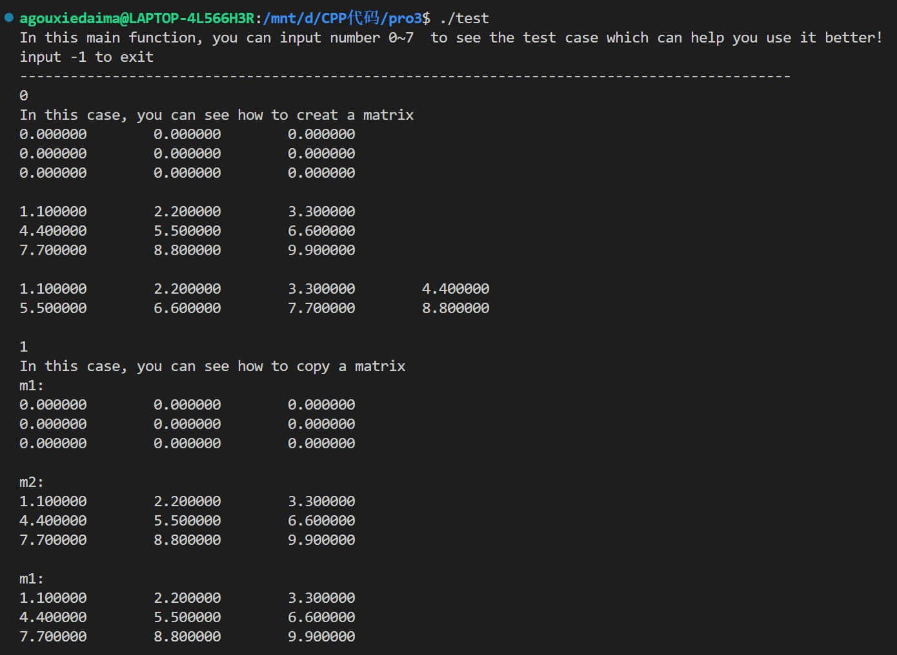
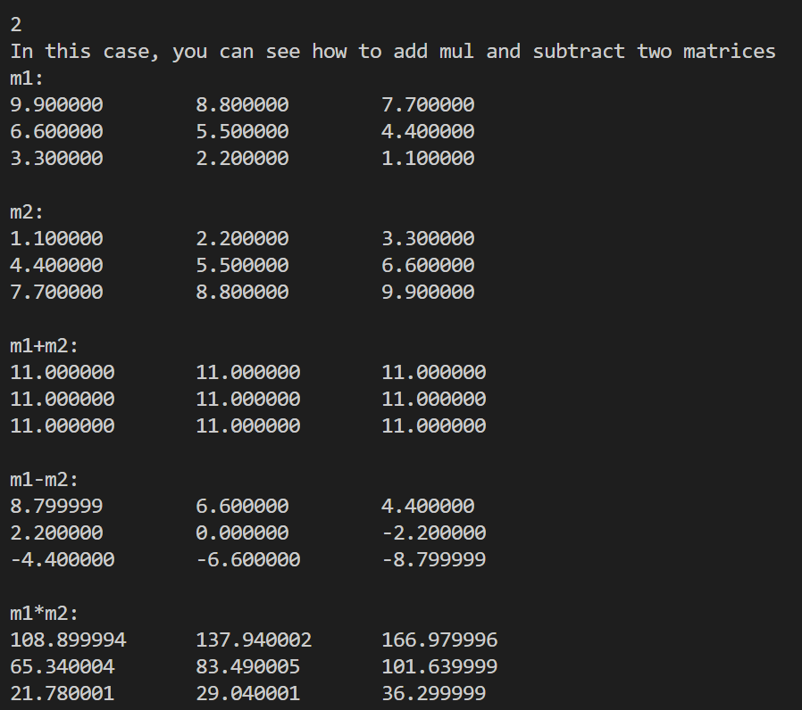
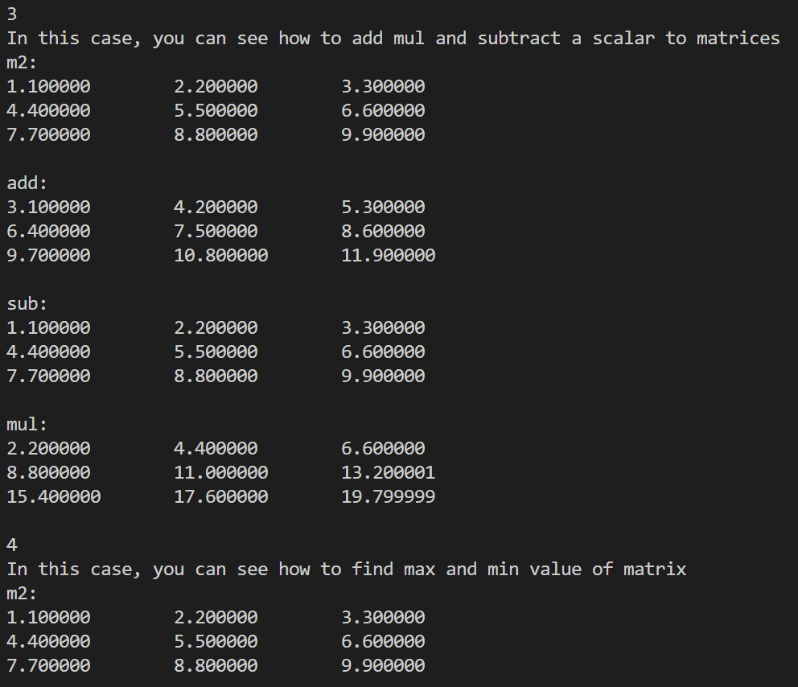
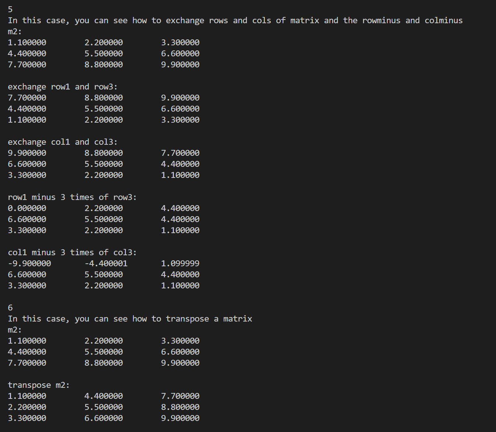
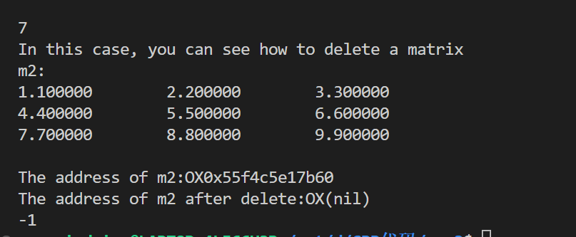

# CS205 C/ C++ Programming - Assignment1
Name: 高祖卿  
SID: 12112710
# Part 1-设计思路与分析
本次作业需要用C语言为矩阵设计一个结构体,里面需要包含矩阵的行数，列数以及矩阵的元素，并且实现一系列方法来方便用户使用。
那么我们会遇到如下问题：
1.结构体中应该有哪些数据成员，他们应该是什么类型的
2.如何维护用户新建出来的矩阵（包括使用和销毁）即如何做好指针和内存管理
3.如何实现一系列函数方法让用户高效使用

下面根据这些问题进行分析
**1.结构体的设计**
```c
typedef struct
{
    long row;
    long col;
    float *data;
} Matrix;
```
首先，矩阵的行和列应该设置为long类型以获得更大的数组。
然后我们将矩阵的元素存在一个一维指针中，方便对其进行内存管理，用二重指针的话，后续对于矩阵的各种操作会更加简单，但是会给指针和内存管理增加很大的麻烦（我们需要用循环来释放内存和将指针置为NULL），因此这里我们选择一维指针。

**2.如何维护指针，如何内存管理**
对于指针，我们需要保证它要么是有效的，要么指向NULL。对于内存，我们申请并使用完后需要及时释放（对于本类，主要是用户需要及时将不用的矩阵delete）。
首先是申请内存和创建指针，大部分的内存申请和指针创造在creat方法中：
```c
//声明一个m*n的矩阵并初始化为0
Matrix *createMatrix_default(Matrix *matrix, int row, int col)
{
    if (row > 0 && col > 0)
    {
        matrix = (Matrix *)malloc(sizeof(Matrix));
        matrix->row = row;
        matrix->col = col;
        matrix->data = (float *)malloc(sizeof(float) * row * col);
        memset(matrix->data, 0, sizeof(float) * row * col);
        return matrix;
    }
    else
    {
        printf("Error in createMatrix_default:The value of row or col must be greater than zero!\n");
        return NULL;
    }
}

//声明一个矩阵并用数组初始化
Matrix *createMatrix_initial(Matrix *matrix, int row, int col, float *array)
{
    if (row > 0 && col > 0)
    {
        matrix = (Matrix *)malloc(sizeof(Matrix));
        matrix->row = row;
        matrix->col = col;
        matrix->data = (float *)malloc(sizeof(float) * row * col);
        memcpy(matrix->data, array, matrix->row * matrix->col * sizeof(float));
        return matrix;
    }
    else
    {
        printf("Error in createMatrix_initial:The value of row or col must be greater than zero!\n");
        return NULL;
    }
}
```
首先，对于指针，本次代码几乎所有的函数的参数都包含一个指向结构体的指针，此举是为了方便检查用户传入的矩阵是否有效（是否已经指向NULL，这代表着矩阵不存在或者已经被删除），因此，我们在声明一个矩阵时返回的是指向这个矩阵的指针，我们通过(Matrix *)malloc(sizeof(Matrix))为其申请一块内存。
其次，对于矩阵的元素，我们用名为data的指针进行管理，通过(float *)malloc(sizeof(float) * row * col)，为其申请一块内存。
至此，我们完成了对矩阵的初步声明，为其指针和元素分别申请了一块内存以方便后续的管理。
现在，我们有两个指针，一个指向矩阵(matrix)，一个指向矩阵中的元素(data)。当我们用完了一个矩阵，我们如何释放它占用的内存以及如何将两个指针置为NULL呢？
```c
//删除一个矩阵 释放空间 指针置NULL
void deleteMatrix(Matrix **matrix)
{
    if (*matrix == NULL)
    {
        printf("Error in deleteMatrix:This matrix has already been deleted!\n");
        return;
    }
    free((*matrix)->data);
    (*matrix)->data = NULL;
    free(*matrix);
    *matrix = NULL;
}
```
在这里，我们传入的参数是对一个指向矩阵的指针的指针，也就是一个二级指针，如果不传入二级指针，我们无法在delete函数中将指向矩阵的指针置为NULL，如果传入一个二级指针，我们很容易通过一次解码来完成对两块内存和两个指针的释放和置NULL。在操作方面，用户手里有的是指向矩阵的指针，用户只需要在传入参数时对指向矩阵的指针取地址即可。
至此，我们初步完成了对指针和内存的管理。

**3.一系列函数的完成**
本次项目的函数内容比较简单，重要的是如何对用户的输入进行检查，在保证程序不崩溃，不退出的情况下让用户进行正确的输入。上面已经说过，几乎所有函数的参数都包含一个指向结构体的指针，用户主要通过指针来进行一系列的矩阵操作，而我们主要对传入的指针进行检查。
下面是声明并初始化矩阵的代码
```c
//声明一个m*n的矩阵并初始化为0
Matrix *createMatrix_default(Matrix *matrix, int row, int col)
{
    if (row > 0 && col > 0)
    {
        matrix = (Matrix *)malloc(sizeof(Matrix));
        matrix->row = row;
        matrix->col = col;
        matrix->data = (float *)malloc(sizeof(float) * row * col);
        memset(matrix->data, 0, sizeof(float) * row * col);
        return matrix;
    }
    else
    {
        printf("Error in createMatrix_default:The value of row or col must be greater than zero!\n");
        return NULL;
    }
}

//声明一个矩阵并用数组初始化
Matrix *createMatrix_initial(Matrix *matrix, int row, int col, float *array)
{
    if (row > 0 && col > 0)
    {
        matrix = (Matrix *)malloc(sizeof(Matrix));
        matrix->row = row;
        matrix->col = col;
        matrix->data = (float *)malloc(sizeof(float) * row * col);
        memcpy(matrix->data, array, matrix->row * matrix->col * sizeof(float));
        return matrix;
    }
    else
    {
        printf("Error in createMatrix_initial:The value of row or col must be greater than zero!\n");
        return NULL;
    }
}

//用数组给矩阵赋值
void valueMatrix_array(Matrix *matrix, float *array)
{
    if (matrix == NULL)
    {
        printf("Error in valueMatrix_array:The matrix does not exist or has been deleted!\n");
    }
    else
    {
        memcpy(matrix->data, array, matrix->row * matrix->col * sizeof(float));
    }
}

//用控制台给矩阵赋值
void valueMatrix_console(Matrix *matrix)
{
    if (matrix == NULL)
    {
        printf("Error in valueMatrix_console:The matrix does not exist or has been deleted!\n");
    }
    else
    {
        printf("matrix(%ld, %ld)  input element:\n", matrix->row, matrix->col);
        for (int i = 0; i < matrix->row; i++)
        {
            for (int j = 0; j < matrix->col; j++)
            {
                int ret;
                char c;
                do
                {
                    ret = scanf("%f", &matrix->data[i * matrix->col + j]);
                    if (ret < 1)
                    {
                        while ((c = getchar()) != EOF && c != '\n')
                            ;
                        i = 0;
                        j = 0;
                        printf("invalid input! Please restart the input\n");
                    }
                } while (ret < 1);
            }
        }
    }
}
```
本次为用户提供了两种声明方法，一种是将矩阵元素全置0的默认声明，一种则需要用户传入一个相应大小的数组来完成矩阵元素的初始化，我们检查了用户对于行和列的输入，如果不合法，我们将会提示用户，并且返回NULL，表示这次声明无效。
后面的所有函数，我们都会对传入的指针进行检查，根据以上所说，如果传入的指针是NULL，那么代表这个指针指向的矩阵是声明无效，或者已经被删除了的矩阵，这样可以有效防止用户对已经不存在的矩阵进行操作从而导致程序崩溃，与此同时，错误的输入并不会导致程序崩溃，我们会提示用户是传入了空指针导致操作失败还是其他原因导致的失败，方便用户找到是哪里出了问题，从而对输入进行修改，直到输入正确。
对于各种矩阵操作的函数，都是这个基调，具体的作用已经在例子中展示。

# Part 2-代码
bb已上传

# Part 3-测试结果




